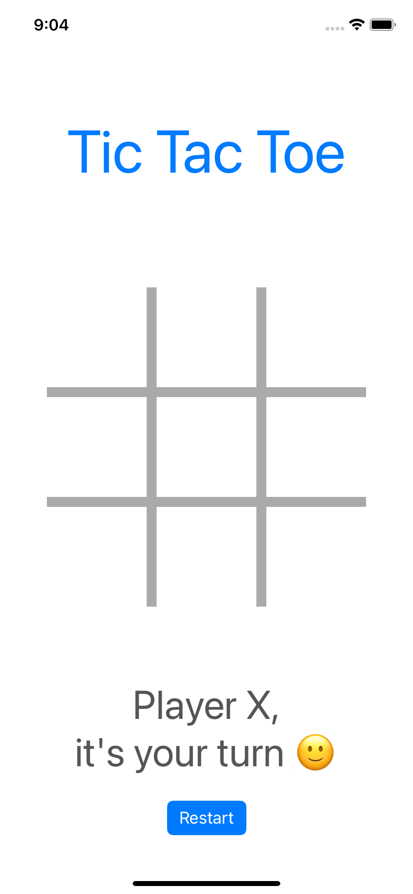
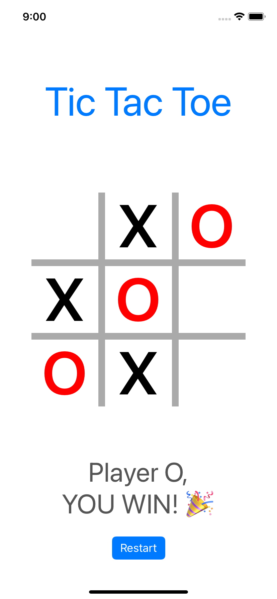
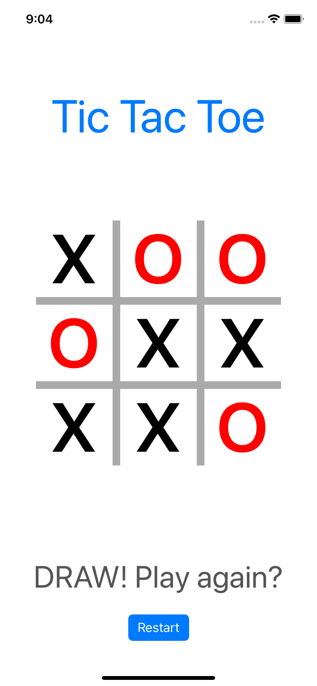

# TicTacToe

This is Tic Tac Toe game :) 

There are two players, Player X and Player O. Each takes a turn to go, starting with Player X. 

A player wins when they have 3 in a row, column, or diagonal. 

  
  
  

